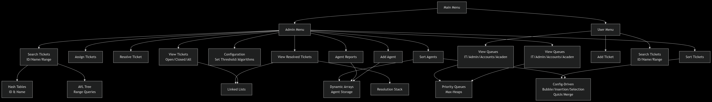

# Automated Ticket Management System

## Overview
The **Automated Ticket Management System (ATMS)** is a comprehensive service request and agent management application designed to efficiently handle tickets from creation through resolution. Built in C++, it leverages multiple Data Structures & Algorithms (DSA) to provide fast operations for ticket creation, searching, sorting, assignment, and resolution. Key components include:

- **Ticket Management** via a doubly linked list
- **Agent Management** via a dynamic array
- **Pending Tickets** via a max‐heap priority queue
- **Resolved Tickets** via a stack
- **Configuration Management** through an external `.conf` file
- **Fast Lookups** via hash tables and an AVL tree for range queries

## Project Blueprint & Framework

---

## Data Structures & Algorithms

| S.No | Data Structures                  | Classes                          | Description                                                                 |
|------|----------------------------------|----------------------------------|-----------------------------------------------------------------------------|
| 1    | Doubly Linked List               | `TicketLinkedList`               | Stores all tickets with support for insertion, deletion, and traversal.     |
| 2    | Dynamic Array                    | `AgentDynamicArray`              | Stores all agents; resizable structure allowing random access.              |
| 3    | Max-Heap Priority Queue          | `PendingTicketsQueue`            | Manages open tickets ordered by priority for assignment.                    |
| 4    | Stack                            | `ResolutionLogisticsStack`       | Logs resolved tickets in LIFO (Last-In, First-Out) order.                   |
| 5    | Hash Table (Separate Chaining)   | `HashTableByID`                  | Enables fast lookup of tickets by integer Ticket ID.                        |
| 6    |                                  | `HashTableByName`                | Enables fast lookup of tickets by customer name (string key).               |
| 7    | AVL Tree                         | `AVLTree`                        | Balanced binary tree for range queries and sorted traversal by Ticket ID.   |
| 8    | Text File                        | `ONESTOPMS.conf`                 | Stores sorting configuration (algorithm types and threshold).               |

| S.No | Algorithms            | Name                  | Description                                                                                  | Implementation Area           |
|------|-----------------------|-----------------------|----------------------------------------------------------------------------------------------|-------------------------------|
| 1    | Sorting               | Bubble Sort           | Compares adjacent items and swaps them if out of order.                                      | Tickets, Agents               |
| 2    | Sorting               | Insertion Sort        | Builds the sorted list by inserting each item into its correct position.                     | Tickets, Agents               |
| 3    | Sorting               | Selection Sort        | Selects the minimum (or maximum) element and places it in the correct position.              | Tickets, Agents               |
| 4    | Sorting               | Merge Sort            | Divide-and-conquer algorithm that recursively merges sorted subarrays.                       | Tickets, Agents               |
| 5    | Sorting               | Quick Sort            | Divide-and-conquer algorithm that partitions and sorts subarrays recursively.                | Tickets, Agents               |

## System-Level Functions & Operations

| S.No | Functions/Operations   | Name                  | Description                                                                 | Implementation Area          |
|------|------------------------|-----------------------|-----------------------------------------------------------------------------|------------------------------|
| 1    | Heap Operations        | Heapify Up/Down       | Maintains max-heap property during insertion or deletion of tickets.        | Pending Ticket Queue         |
| 2    | Stack Operations       | Push / Pop            | Adds or removes resolved tickets in LIFO order.                             | Resolution Stack             |
| 3    | Hashing                | Modulo Hashing        | Computes hash index using modulo of ticket ID.                              | Ticket ID Hash Table         |
| 4    | Hashing                | Polynomial Hashing    | Computes hash index from character-weighted sum of names.                   | Ticket Name Hash Table       |
| 5    | Tree Traversal         | In-order Traversal    | Visits nodes in ascending order of Ticket ID.                               | AVL Tree                     |
| 6    | Tree Balancing         | AVL Rebalancing       | Ensures balanced tree via rotations after insertions.                       | AVL Tree                     |
| 7    | File I/O               | Configuration Parsing | Reads and writes sorting algorithm settings and thresholds.                 | ONESTOPMS.conf Configuration |

## Features & Requirements

### 1. Service Request (Ticket) Management
- **Create**, **view**, and **manage** service tickets.
- Each ticket has:
  - Unique Ticket ID (randomized 0–999,999)
  - Priority level (integer)
  - Request type/statement (e.g., IT, Admin, Accounts, Academics)
  - Creation timestamp; optional closing timestamp
  - `isOpen` flag
- **Operations**:
  - Print all tickets, open-only, or closed-only
  - Close a ticket (records closing time)

### 2. Agent Management
- Agents have:
  - Unique Agent ID
  - Name and department/type
  - Up to 5 assigned tickets
  - Availability flag
- **Operations**:
  - Add new agents
  - Assign tickets to least-busy appropriate agent
  - Resolve tickets (pop from agent’s queue)
  - Print agent summaries

### 3. Ticket Resolution & Pending Tickets
- **Pending Tickets Queue**:  
  - Max-heap based priority queue (heap array doubles as needed)
  - Enqueue only open tickets by priority
  - Dequeue highest-priority ticket; peek front/back
  - Display sorted snapshot of pending tickets
- **Resolution Logistics Stack**:  
  - Push closed tickets (LIFO)
  - Peek most recent resolution
  - Print full resolution log

### 4. Configuration Management
- External file: `ONESTOPMS.conf`
- **Parameters**:
  - `threshold`: number of items to switch sort algorithm
  - `sortHigh`: algorithm for datasets > threshold
  - `sortLow`: algorithm for datasets ≤ threshold
- Load on start; save on change
- Default: `quick` for large, `insertion` for small, threshold = 10

### 5. Search & Reporting
- **HashTableByID**: O(1) lookup of tickets by integer ID
- **HashTableByName**: O(1) lookup by customer name
- **AVLTree**: balanced BST on Ticket ID for range queries
- Main menu options for:
  - Search by ID, name, or ID range
  - Display AVL range query results

### 6. Sorting & Analysis Reports
- Tickets and agents can both be sorted via configurable algorithms  
- Measures and reports sort duration in milliseconds  
- Sorting algorithms implemented for each DS (see table below)
